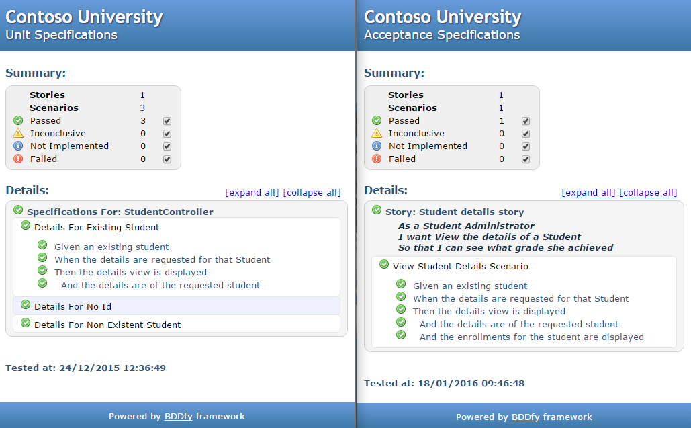

## What is Specify?
Specify is a BDD-style testing library for .Net that builds on top of BDDfy from [TestStack](http://www.teststack.net/). While BDDfy is primarily intended for BDD testing, it is beautifully designed to be very easy to customize and extend. Specify provides base test fixtures that extend BDDfy with support for containers - both Inversion of Control (IoC) containers and auto mocking containers - which act as a SUT factory to automatically create the SUT (System Under Test) and other dependencies.

## Where do you get it?

The source code is available on [GitHub](https://github.com/mwhelan/Specify), and you can [download the compiled library with NuGet](https://www.nuget.org/packages/Specify/).

## What problem does Specify address?
Do you write your unit tests in an Arrange, Act, Assert style with an (x)unit test framework and your user story tests with BDDfy or SpecFlow in a Given When Then style, perhaps with a different (x)unit test framework?

Specify provides you with a consistent Given When Then, class per scenario, style for all of your tests, with the same high quality BDDfy HTML reports for all. 

Specify also provides a consistent API to use a Container in your tests, with the underlying container behaving very differently as it might be an auto mocking container or your application's IoC container, depending on how you configure Specify to run. The container is built once at the start of the test run and then a child container is created for each test so that you can customize it on a per test basis. 

You can read more about this use of containers in tests [here](https://lostechies.com/jimmybogard/2012/03/19/integrating-and-isolating-the-container-in-tests/).

## Specify supports GitHub source stepping
Specify uses [GitLink](https://github.com/GitTools/GitLink), which "lets users step through your code hosted on GitHub." Specify uses GitLink when creating its NuGet package to reference the exact version of the code on GitHub that was used to build the package. This allows you to step from your test code into Specify.

Just follow the instructions on the GitLink GitHub home page to enable source server support. Note, I've also found that you need to uncheck the `Enable Just My Code` option in the same dialog.

## Contributing

If you would like to contribute to this project then feel free to communicate with me via Twitter @mjmwhelan or alternatively send a pull request/issue to this GitHub project.

