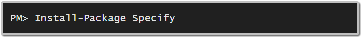

## Installing and Configuring Specify

I am assuming that you have a test project that you want to write tests in and that you are using Visual Studio. This could be a unit tests project for MsTest, or a class library for other test frameworks.

## Add NuGet package
Specify is available as a NuGet package. You can add it via the `Manage NuGet Packages` dialog or by the `Package Manager Console`.

To add Specify via the `Manage NuGet Packages` dialog, just right-click on `References` in your test project and select `Manage NuGet Packages`. From the dialog, search for Specify and then click the `Install` button on the Specify package. Note, you will need to check the `Include prerelease` checkbox to get the latest version 1.0.0 beta.

To add Specify via the `Package Manager Console`, from the Menu select `Tools > NuGet Package Manager > Package Manager Console`, then type the following in the console:

Note, you will have to append `-Pre` to this command to get the beta version of v1.0.0 at this time.

NuGet will install Specify and the latest version of TestStack.BDDfy. It will also add two C# files to your test project:

- **ScenarioFor.cs**: Base classes that all your scenarios will inherit from. Just wrappers around the real ScenarioFors in Specify with the sole function of wiring up your test framework.
- **SpecifyBootstrapper.cs**: The startup class to configure Specify with the built-in [TinyIoc](https://github.com/grumpydev/TinyIoC) container. Make any changes to the default configuration settings in this file.

# Configure Your Test Framework
Like BDDfy, Specify can run with any testing framework. Well, NUnit, xUnit, MsTest and Fixie anyway, which are the ones I've tried it with. 

If you are using NUnit, xUnit, or MsTest, then you need to provide the attributes that they need to discover and run your specifications. The good news is that you only have to provide this information once, on your base class - all of the specifications that you write will inherit from this class and not need any attributes. 

- open `ScenarioFor.cs`
- uncomment the attributes for your test framework on the two `ScenarioFor` classes 
- delete the attributes for the other frameworks.

If you are using [Fixie](http://fixie.github.io/), then you can use Specify as is, and you just have to provide a convention to tell it how to discover and run your specifications.

- open `ScenarioFor.cs`
- delete the two `ScenarioFor` classes 
- uncomment the `FixieSpecifyConvention` class.

At this stage, I've decided not to release separate NuGet packages for each test framework. I don't think it's worth it for a few lines of code. 

## Configure Specify
Make any configuration changes to Specify in the SpecifyBootstrapper.cs class that was added to your test project. Feel free to rename this class if you prefer.

## Additional Steps
### For Unit Test projects
Install one of these mocking frameworks:

- NSubstitute
- FakeItEasy
- Moq

	Install-Package NSubstitute
	Install-Package FakeItEasy
	Install-Package Moq

Alternatively, you could provide a simple adapter and plug in another mocking framework.

### For Integration Test projects